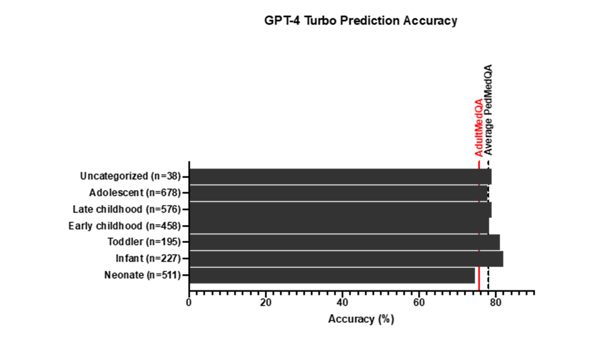

# PedMedQA: Evaluating Large Language Models in Pediatrics and Adult Medicine

## Overview
**PedMedQA** is an openly accessible pediatric-specific benchmark for evaluating the performance of large language models (LLMs) in pediatric scenarios. It is curated from the widely used MedQA benchmark and allows for population-specific assessments by focusing on multiple-choice questions (MCQs) relevant to pediatrics.

## Dataset Details

- **Pediatric-Specific Dataset**: PedMedQA includes 2,683 MCQs curated specifically for pediatric cases.
- **Age-Based Subcategorization**: Questions are categorized into five age groups based on the Munich Age Classification System (MACS):
  - Neonates (0-3 months)
  - Infants (greater than 3 months to 2 years)
  - Early Childhood (greater than 2 years to 10 years)
  - Adolescents (greater than 10 years to 17 years)
- **Evaluation**: Performance of GPT-4 Turbo across pediatric (PedMedQA) and adult (AdultMedQA) datasets.

PedMedQA aims to fill this gap by providing a pediatric-focused subset of MedQA, enabling systematic evaluation of LLMs on age-specific clinical scenarios.

## Data Structure

The dataset is provided in CSV format, with the following structure:
- **index**: Original unique identifier for each question extracted from MedQA.
- **meta_info**: Original meta-info extracted from MedQA.
- **Question**: The medical multiple-choice question in the local language.
- **answer_idx**: The correct answer's label.
- **answer**： The correct answer in text format.
- **Options**: List of possible answers (A-D).
- **age_years**: The age descriptor presented in years.


## Results



- Accuracy on pediatric MCQs (PedMedQA): **78.1% (95% CI [77.8%, 78.4%])**
- Accuracy on adult MCQs (AdultMedQA): **75.7% (95% CI [75.5%, 75.9%])**
- Performance across pediatric age groups ranged from **74.6% (neonates)** to **81.9% (infants)**.

These results suggest that GPT-4 Turbo performs comparably on pediatric and adult MCQs, maintaining a consistent level of accuracy across age-specific clinical scenarios.

## Download and Usage

The dataset can be downloaded from:
- [Hugging Face datasets page](https://huggingface.co/datasets/yma94/PedMedQA)
- [Github](https://github.com/yma-94/PedMedQA).

## Citation

If you use PedMedQA in your work, please cite:

```
Nikhil Jaiswal, Yuanchao Ma, Bertrand Lebouché, Dan Poenaru, Esli Osmanlliu; PedMedQA: Comparing Large Language Model Accuracy in Pediatric and Adult Medicine. Pediatrics Open Science 2025; https://doi.org/10.1542/pedsos.2025-000485
```

## License

This project is licensed under the [CC-BY-NC-ND-4.0](LICENSE).